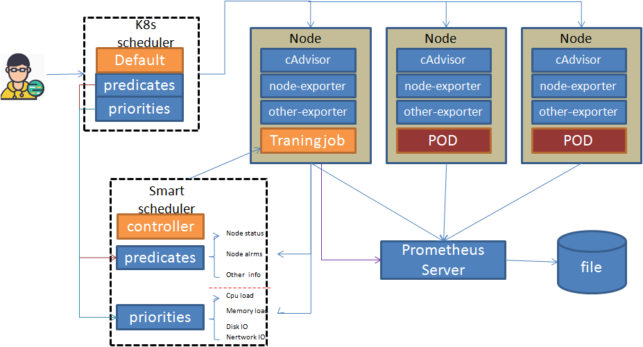

Smartsc
------

smartsc是一个kubernetes的扩展调度器.
它的简单实现原理如下：  
1   smart scheduler 动态获取 k8s中的主机信息，启动或更新tf training job。  
2.  tf training job 从 prometheus中获取主机的监控数据，输出可用于调度的主机状态信息、主机负载信息等，更新这些信息到smart scheduler。  
3. 通过extender方式集成k8s原生调度器和smart scheduler，  
   参考文档：https://github.com/kubernetes/community/blob/master/contributors/design-proposals/scheduler_extender.md  
4. 使用两个调度器的predicates调度策略筛选主机，打分阶段综合考虑k8s原生的调度规则和smart scheduler的调度规则，选择最符合要求的主机部署pod。  

原理图如下所示：

Requirements
------------

-	Kubernetes v1.5.0以上

TODO
----

This is still WIP. 
